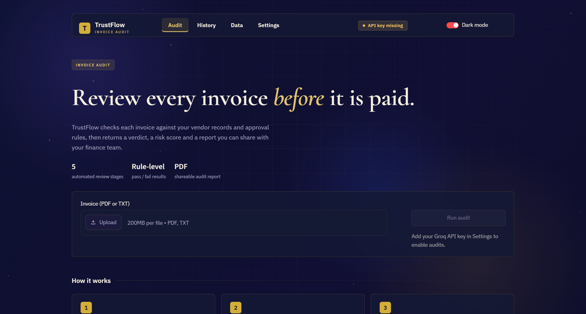

# TrustFlow — AI Invoice Audit

An AI-powered invoice auditing system built with CrewAI and Streamlit. Upload an invoice, get back a rule-by-rule audit, a risk score, and a verdict of APPROVE, REVIEW, or REJECT.



## About

TrustFlow is a multi-agent AI system that automates the invoice review step of accounts payable. Every invoice is read, classified, and validated against your own vendor list and business rules before payment. Instead of a finance team manually eyeballing amounts, PO numbers, and tax IDs, TrustFlow runs five specialized AI agents in sequence, produces a rule-by-rule audit trail, and returns a verdict your team can act on — **APPROVE**, **REVIEW**, or **REJECT** — with a risk score and a downloadable PDF report.

Built as a project to explore production-grade LLM orchestration: real database persistence (Supabase), full agent-level observability (LangSmith), deterministic guardrails around probabilistic models, and a clean separation between frontend, orchestration, and storage.

## What It Does

1. Reads an uploaded invoice (PDF or TXT)
2. Runs a 5-agent CrewAI pipeline:
   - **Intake** — classifies the document (invoice / form / application / unknown)
   - **Extractor** — pulls vendor, invoice number, amount, date, PO number, tax ID
   - **Validator** — evaluates the invoice against 9 business rules
   - **Router** — computes risk score and verdict
   - **Reporter** — writes a human-readable summary and next action
3. Applies a deterministic rule engine and confidence gate on top of the agents
4. Traces every agent step in LangSmith (via OpenTelemetry)
5. Persists vendors, rules, invoices, and audit results in Supabase
6. Returns a styled dashboard with verdict card, rule checks, and a downloadable PDF report

## Stack

- **CrewAI** — multi-agent orchestration
- **Groq** — LLM inference (`openai/gpt-oss-120b` for reasoning, `gpt-oss-20b` for cheaper steps)
- **Streamlit** — frontend
- **Supabase** — Postgres database + storage for vendors, rules, invoices, audits
- **LangSmith** — observability (agent-level traces via OpenTelemetry)
- **pypdf** — PDF text extraction
- **ReportLab** — PDF report generation
- **Altair** — dashboard charts

## Features

- 🎨 Dark modern dashboard with gradient verdict cards and animated backdrop
- 🔐 User-supplied Groq API key (session-only, never stored on the server)
- 🧭 Multi-page navigation: **Audit**, **History**, **Data**, **Settings**
- ⚙️ Upload your own `vendors.csv` and `rules.json` — stored in Supabase
- 🗑️ One-click database management with confirmation (delete vendors, rules, or both)
- 🔍 Per-rule pass/fail rendering with severity indicators
- 📄 Downloadable PDF audit report per audit
- 📜 Audit history with KPIs, verdict filter, and search
- 📡 Full agent-level tracing in LangSmith — every prompt, response, and latency
- 🌗 Dark / light theme toggle

## Verdict Logic

Risk score is the weighted percentage of failed rules.

| Score    | Verdict        | Meaning          |
|----------|----------------|------------------|
| 0 – 30   | 🟢 **APPROVE** | Safe to pay      |
| 31 – 70  | 🟡 **REVIEW**  | Needs human eyes |
| 71 – 100 | 🔴 **REJECT**  | Do not pay       |

## Install

```bash
python -m venv .venv
.venv\Scripts\Activate.ps1     # Windows
# source .venv/bin/activate    # macOS / Linux
pip install -r requirements.txt
```

## Configure

Copy `.env.example` to `.env` and fill in:

```text
GROQ_API_KEY=your_groq_key
LANGSMITH_API_KEY=your_langsmith_key
LANGSMITH_TRACING=true
LANGSMITH_PROJECT=trustflow
LANGSMITH_ENDPOINT=https://api.smith.langchain.com
SUPABASE_URL=https://your-project.supabase.co
SUPABASE_KEY=your_publishable_key
```

Get your keys:

- **Groq:** [console.groq.com/keys](https://console.groq.com/keys)
- **LangSmith:** [smith.langchain.com](https://smith.langchain.com) → Settings → API Keys
- **Supabase:** Project → Settings → API

## Set Up Supabase

1. Create a project at [supabase.com](https://supabase.com)
2. Open **SQL Editor** → paste the contents of `supabase/schema.sql` → **Run**
3. Confirm 8 tables exist: `organizations`, `users`, `vendors`, `rules`, `invoices`, `audits`, `audit_checks`, `audit_logs`
4. Confirm the `organizations` table has one row: `Demo Org`

## Run

```bash
streamlit run app.py
```

Open <http://localhost:8501>.

1. Go to **Settings** → paste your Groq API key
2. Go to **Data** → upload `data/vendors.csv` and `data/rules.json`
3. Go to **Audit** → upload an invoice (PDF or TXT), click **Run Audit**
4. Go to **History** → see past audits with KPIs and filters

## Test From CLI

```bash
python -m backend data/invoices/sample_invoice.txt
```

## Sample Invoices

Three test invoices are included in `data/invoices/`:

| File                   | Expected verdict |
|------------------------|------------------|
| `sample_invoice.txt`   | 🟢 APPROVE       |
| `review_invoice.txt`   | 🟡 REVIEW        |
| `rejected_invoice.txt` | 🔴 REJECT        |

## Project Layout

```text
app.py                      Streamlit UI
backend/
  api.py                    run_audit() — the only public entry point
  crew.py                   builds the 5-agent crew
  gate.py                   confidence gate
  llm.py                    Groq model factory
  tools.py                  PDF reading, rule checking, scoring
  guardrails.py             input/output validation, PII masking
  audit.py                  DB-backed audit logger
  db.py                     Supabase client and query helpers
  tracing.py                LangSmith OpenTelemetry wrapper
  config.py                 paths, constants, env vars, OTel setup
  agents/
    intake_agent.py         classifies document type
    extractor_agent.py      pulls invoice fields
    validator_agent.py      runs business rules
    router_agent.py         computes verdict
    reporter_agent.py       writes summary
supabase/
  schema.sql                database schema
data/
  vendors.csv               sample approved vendor list
  rules.json                sample validation rules
  invoices/                 sample invoices (approve / review / reject)
  uploads/                  runtime uploads
  audit_log.jsonl           local fallback log
```

## API Contract

```python
from backend.api import run_audit

result = run_audit(file_bytes, filename, org_id, api_key)
```

Returns:

```python
{
  "invoice": {vendor, invoice_number, amount, date, po_number, tax_id},
  "checks": [{rule, status, reason, weight, severity}],
  "risk_score": int,
  "verdict": "APPROVE" | "REVIEW" | "REJECT",
  "routing_reason": str,
  "summary": str,
  "next_action": str,
  "gate": {passed, confidence, warnings, final_verdict},
  "audit_id": str,
  "error": str   # only present on failure
}
```

## Observability

Every audit produces a full agent trace in LangSmith (via OpenTelemetry). Open the `trustflow` project to inspect:

- Each of the 5 agents as a nested span
- Every LLM call with the exact prompt and response
- Per-agent latency
- Audit-level tags: `verdict:APPROVE`, `org:<id>`, `risk:<n>`
- Custom metadata: filename, confidence, gate warnings

Filter traces by verdict, org, or filename to isolate problem cases.

## Deployment (Streamlit Cloud)

1. Push the repo to GitHub
2. On [share.streamlit.io](https://share.streamlit.io), create an app pointing to `app.py`
3. In **Settings → Secrets**, add the same keys from `.env`
4. Set Python version to **3.13** in Settings. Works with 3.10–3.13; avoid 3.14 since CrewAI and tiktoken don't ship wheels for it yet
5. Reboot the app

> **Note:** `data/uploads/`, `data/audit_log.jsonl`, and `data/results.json` are ephemeral on Streamlit Cloud. Use Supabase for persistence.

## Known Limitations

- Free-tier Groq is capped at 8,000 TPM — heavy audits may retry or require upgrading to Dev tier
- Row Level Security is disabled in the demo schema; re-enable when auth is added
- The demo uses a hardcoded `DEMO_ORG_ID`; multi-tenancy requires Supabase Auth
- Validator and Router LLM outputs are overridden by a deterministic Python rule engine to guarantee correct verdicts

## Team

- **Backend / Integration** — Tabasum
- **Agents (Intake, Extractor)** — Joti
- **Frontend** — Ayesha